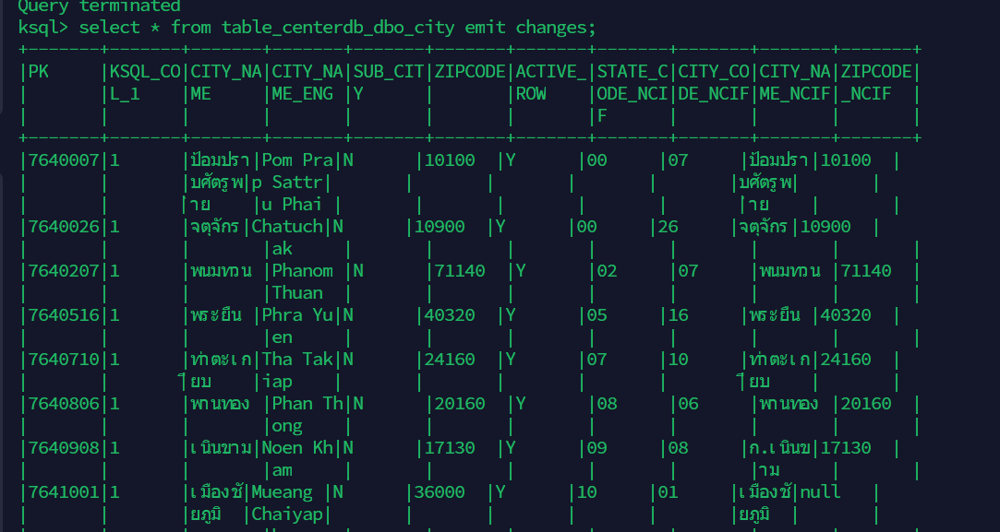

# Kafka Config flow :skull:
## Source
- The Configuration file in json format
    > This for MSSQL source connector
```json
{
    "name": "source_hippo_motordb_applicants_connector",
    /*Configuration name (Mandatory)*/
    "config": {
        "connector.class": "io.debezium.connector.sqlserver.SqlServerConnector",
        /*เป็นตัว source connect ของไฟล์ config นี้ ในที่นี้จะต่อกับ debezium sql server (Mandatory)*/
        "tasks.max": "1",
        /*เป็นตัวเลขที่ task จะถูกสร้าง (Optional, Default = 1)*/
        "key.converter": "io.confluent.connect.avro.AvroConverter",
        /*กำหนดการแปลงข้อมูล PK ให้อยู่ในรูปแบบ AVRO (แนะนำ) และยังสามารถแปลงให้เป็น JSON, KAFKA ด้วย (Mandatory)*/
        "value.converter": "io.confluent.connect.avro.AvroConverter",
        /*กำหนดการแปลงข้อมูล Value ให้อยู่ในรูปแบบ AVRO (แนะนำ) และยังสามารถแปลงให้เป็น JSON, KAFKA ด้วย (Mandatory)*/
        "transforms": "rename, unwrap",
        /*เป็น list ตัวเรียก function SMT ต้องระวังเรื่อง order ก่อนหลัง (Optional)*/
        "transforms.rename.type": "org.apache.kafka.connect.transforms.RegexRouter",
        /*SMT function ของ RegexRouter (Optional)*/
        "transforms.rename.regex": "(.*)viriyah.co.th(.*)",
        /*เป็น function regex "viriyah.co.th" (Optional)*/
        "transforms.rename.replacement": "$1motordb$2",
        /*ต่อเนื่องมาจาก function regex ในที่นี้เราจะแทนด้วย motordb (Optional)*/
        "transforms.unwrap.type": "io.debezium.transforms.ExtractNewRecordState",
        /*SMT function ของ ExtractNewRecordState มีไว้เพื่อแตกข้อมูล value ออกเป็น column ถ้าไม่ใส่ข้อมูลที่ไหลมาจะมี befor, after ซึ่งต้องไป select ทีละ column ทีหลังที่ ksql เลือกใช้ตามความสะดวก (Optional)*/
        "transforms.unwrap.drop.tombstones": "false",
        /*เลือกว่าเก็บ tomstone (NULL value) เนื่องมาจากเก็บข้อมูลที่ถูกลบไป (Optional)*/
        "database.server.name": "hippo.viriyah.co.th",
        /*server name (Mandatory)*/
        "database.dbname": "motordb",
        /*database name (Mandatory)*/
        "database.hostname": "hippo.viriyah.co.th",
        /*host name (Mandatory)*/
        "database.port": "1433",
        /*port number (Mandatory)*/
        "database.user": "dmp_prd",
        /*user name (Mandatory)*/
        "database.password": "**********",
        /*password (Mandatory)*/
        "time.precision.mode": "connect",
        /*เป็นตัวบอก timestamp (Mandatory)*/
        "table.include.list":"dbo.applicants", 
        /*select table (Optional)*/
        "column.include.list":"dbo.applicants.apply_year, dbo.applicants.apply_branch, dbo.applicants.apply_no, dbo.applicants.flag_cancel_sameday", 
        /*select column (Optional)*/
        "database.history.kafka.bootstrap.servers": "broker:29092",
        /*connect database kafka history เข้ากับ bootstrap (Mandatory)*/
        "database.history.kafka.topic": "dbhistory.motordb.applicants",
        /*กำหนดชื่อ kafka topic name สำหรับเก็บ database schema history (Mandatory)*/
        "table.whitelist": "dbo.applicants",
        /*select table (Mandatory)*/
        "topic.creation.default.partitions": "1",
        /*กำหนด number of partition (Mandatory)*/
        "transforms.extractValue.type": "org.apache.kafka.connect.transforms.ExtractField$Value",
        /*แตกค่า value ออกมาเป็น columnๆ (Mandatory)*/
        "topic.creation.default.replication.factor": "1",
        /*กำหนด number of replication (Mandatory)*/
        "delete.handling.mode": "none",
        /*ถ้า debezium จับได้ว่า record นั้นถูกลบไปแล้ว ก็จะมี message value ที่เป็น NULL (Mandatory)*/
        "confluent.topic.bootstrap.servers": "kafka:29092",
        /*connect topic กับ bootstrap (Mandatory)*/
        "topic.creation.default.cleanup.policy": "delete",
        /*log retention policy (Mandatory)*/
        "value.converter.schema.registry.url": "http://schema-registry:8081",
        /*register schema value (Mandatory)*/
        "key.converter.schemas.enable": "true",
        /*convert schema key (Mandatory)*/
        "snapshot.mode": "schema_only",
        /*ให้ดึงข้อมูลหลังจากที่ connect กับตัว json file นี้ (Optional)*/
        "transforms.extractValue.field": "after",
        /*เลือก extract value after (Optional)*/
        "value.converter.schemas.enable": "true",
        /*convert schema value (Mandatory)*/
        "key.converter.schema.registry.url": "http://schema-registry:8081",
        /*register schema key (Mandatory)*/
        "schemas.enable": "true"
        /*enable schema (Mandatory)*/
    }
  }
```

## KSQLDB on Confluent
### Creating stream & table
1. Creating stream from topics
```sql
CREATE STREAM stream_centerdb_dbo_city WITH (KAFKA_TOPIC='virnonmotorag01.viriyah.co.th.dbo.city', VALUE_FORMAT='AVRO');
```

2. Creating stream from stream (set partition for creating table by pk)
```sql
CREATE STREAM stream_centerdb_dbo_city_REKEYED AS SELECT * FROM stream_centerdb_dbo_city PARTITION BY country_code+state_code+city_code;
```

3. Creating table from stream
```sql
CREATE TABLE table_centerdb_dbo_city WITH (KAFKA_TOPIC='stream_centerdb_dbo_city_REKEYED', VALUE_FORMAT='avro')
as select
count(*),
COUNTRY_CODE+STATE_CODE+CITY_CODE as "PK",
latest_by_offset(CITY_NAME, false) as "CITY_NAME",
latest_by_offset(CITY_NAME_ENG, false) as "CITY_NAME_ENG",
latest_by_offset(SUB_CITY, false) as "SUB_CITY",
latest_by_offset(ZIPCODE, false) as "ZIPCODE",
latest_by_offset(ACTIVE_ROW, false) as "ACTIVE_ROW",
latest_by_offset(STATE_CODE_NCIF, false) as "STATE_CODE_NCIF",
latest_by_offset(CITY_CODE_NCIF, false) as "CITY_CODE_NCIF",
latest_by_offset(CITY_NAME_NCIF, false) as "CITY_NAME_NCIF",
latest_by_offset(ZIPCODE_NCIF, false) as "ZIPCODE_NCIF"
from stream_centerdb_dbo_city_REKEYED
group by
COUNTRY_CODE+STATE_CODE+CITY_CODE;
```


### join in ksql
1. join steam with multiple table
    > we need pk for each tables to join
```sql
CREATE TABLE JOINED_TABLE3 WITH (KAFKA_TOPIC='joined_table_clmngasset3', KEY_FORMAT='AVRO', PARTITIONS=1, REPLICAS=1, VALUE_FORMAT='AVRO') AS SELECT
NG.ID NG_ID,
latest_by_offset(NG.CLMNG_ID, false) CLMNG_ID,
latest_by_offset(NG.BILL_CODE, false) BILL_CODE,
latest_by_offset(NG.NGASSET_CLMPERSONID, false) NGASSET_CLMPERSONID,
latest_by_offset(P.FNAME, false) FNAME,
latest_by_offset(P.LNAME, false) LNAME,
latest_by_offset(TB.BILL_DESC, false) BILL_DESC,
latest_by_offset(NL.NG_YR, false) NG_YR,
latest_by_offset(NL.NG_NO, false) NG_NO,
latest_by_offset(SV.ID, false) SV_ID,
latest_by_offset(SV.CLMNOTIFY_ID, false) CLMNOTIFY_ID
FROM STREAM_CLMNMDB_DBO_CLMNGASSET NG
INNER JOIN TABLE_CLMNMDB_DBO_CLMPERSON_PK_ID P ON ((P.ID = NG.NGASSET_CLMPERSONID))
INNER JOIN TABLE_CLMNMDB_DBO_TAB_BILLFOR_PK_BILL_CODE TB ON ((NG.BILL_CODE = TB.BILL_CODE))
INNER JOIN TABLE_CLMNMDB_DBO_CLMNG_PK_ID NL ON ((NL.ID = NG.CLMNG_ID))
INNER JOIN TABLE_CLMNMDB_DBO_CLMSVASSET_PK_ID SV ON ((SV.ID = NL.CLMSVASSET_ID))
GROUP BY NG.ID
EMIT CHANGES;
```


### ETC


## Sink
- The Configuration file in json format
    > This for Oracle ATP sink connector
```json
{
    "name": "sink_hippo_motordb_applicants_connector",
    /*Configuration name (Mandatory)*/
    "config": {
        "connector.class": "io.confluent.connect.jdbc.JdbcSinkConnector",
        /*เป็นตัว sink connect ของไฟล์ config นี้ ในที่นี้จะต่อกับ oracle atp (Mandatory)*/
        "tasks.max": "1",
        /*เป็นตัวเลขที่ task จะถูกสร้าง (Optional, Default = 1)*/
        "key.converter": "io.confluent.connect.avro.AvroConverter",
        /*กำหนดการแปลงข้อมูล PK ให้อยู่ในรูปแบบ AVRO (แนะนำ) และยังสามารถแปลงให้เป็น JSON, KAFKA ด้วย (Mandatory)*/
        "value.converter": "io.confluent.connect.avro.AvroConverter",
        /*กำหนดการแปลงข้อมูล Value ให้อยู่ในรูปแบบ AVRO (แนะนำ) และยังสามารถแปลงให้เป็น JSON, KAFKA ด้วย (Mandatory)*/
        "errors.tolerance": "none",
        /*กำหนดให้หยุดเมื่อเกิด error (Mandatory)*/
        "topics": "hippo.motordb.dbo.applicants",
        /*Topic ที่เลือกมา sink (Mandatory)*/
        "table.name.format": "HIPPO_MOTORDB_APPLICANTS",
        /*Destination table (Mandatory)*/
        "transforms": "RenameField, RenameKey",
        /*เป็น list ตัวเรียก function SMT ต้องระวังเรื่อง order ก่อนหลัง (Optional)*/
        "connection.url": "jdbc:oracle:thin:@obiwandp01_low?TNS_ADMIN=/oracle_wallet",
        /*connection to destination server (Mandatory)*/
        "connection.user": "CDCSUB",
        /*user name to acess to destination server (Mandatory)*/
        "connection.password": "***********",
        /*password (Mandatory)*/
        "dialect.name": "OracleDatabaseDialect",
        /*เลือกชนิดของ database (Mandatory)*/
        "insert.mode": "upsert",
        /*insert mode มีทั้ง insert, upsert (Mandatory)*/
        "delete.enabled": "true",
        /*สามารถที่จะลบข้อมูลปลายทางไหม ? (Mandatory)*/
        "batch.size": "1",
        /*จำนวนของ message (Mandatory)*/
        "transforms.RenameField.type": "org.apache.kafka.connect.transforms.ReplaceField$Value",
        /*SMT function ของ ReplaceField$Value value (Optional)*/
        "transforms.RenameField.renames": "apply_year:APPLY_YEAR, apply_branch:APPLY_BRANCH, apply_no:APPLY_NO, flag_cancel_sameday:FLAG_CANCEL_SAMEDAY",
        /*เปลี่ยน lower case ให้เป็น upper case เนื่องจาก oracle atp จะเป็น upper case default (Optional)*/
        "transforms.RenameKey.type": "org.apache.kafka.connect.transforms.ReplaceField$Key",
        /*SMT function ของ ReplaceField$Value PK (Optional)*/
        "transforms.RenameKey.renames": "apply_year:APPLY_YEAR, apply_branch:APPLY_BRANCH, apply_no:APPLY_NO",
        /*เปลี่ยน lower case ให้เป็น upper case เนื่องจาก oracle atp จะเป็น upper case default (Optional)*/
        "pk.mode": "record_key",
        /*เลือกตัวทีต้องการไปจับ ในที่นี้จะดเป็น record key (Mandatory)*/
        "pk.fields": "APPLY_YEAR, APPLY_BRANCH, APPLY_NO",
        /*เลือก column ที่เป็น PK เพื่อ function (Mandatory)*/
        "auto.create": "false",
        /*จะให้ auto สร้าง table ใหม่ไหม ถ้าหา destination table ไปเจอ (Optional)*/
        "auto.evolve": "true",
        /*ให้ auto จับการเปลี่ยนแปลง alter destination table config ไหม (Optional)*/
        "confluent.topic.bootstrap.servers": "kafka:29092",
        /*connect topic กับ bootstrap (Mandatory)*/
        "value.converter.schema.registry.url": "http://schema-registry:8081",
        /*register schema value (Mandatory)*/
        "key.converter.schema.registry.url": "http://schema-registry:8081"
        /*register schema key (Mandatory)*/
    }
}
```